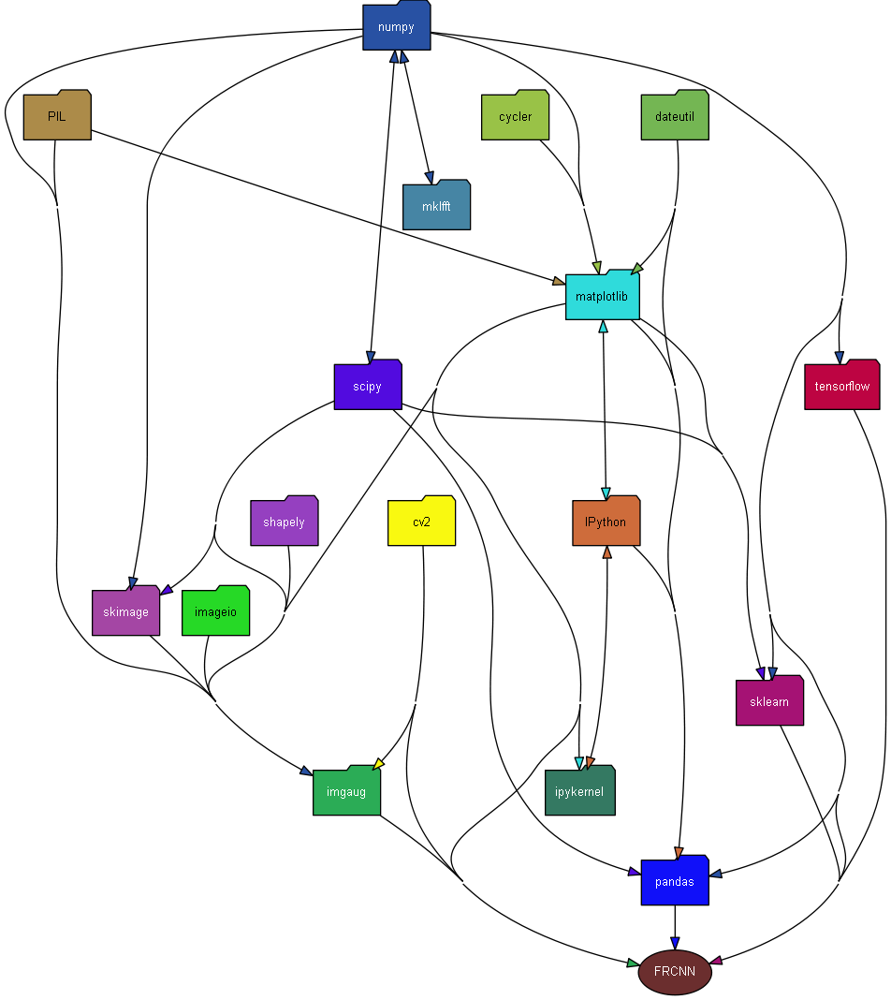
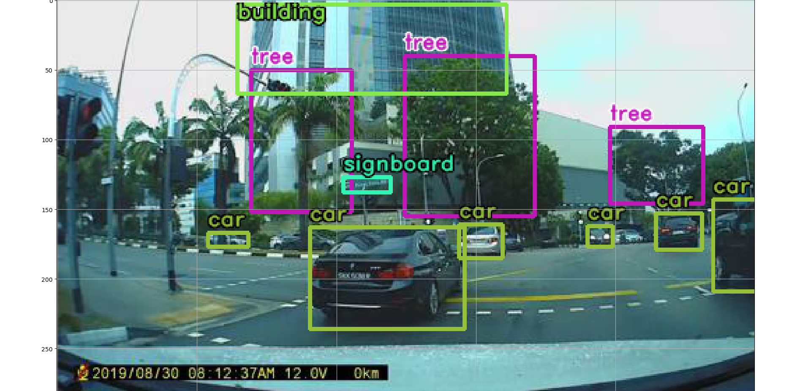
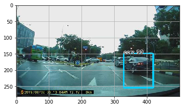
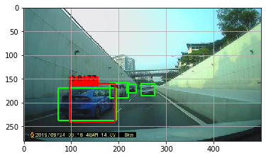

[![Contributors][contributors-shield]][contributors-url]
[![Forks][forks-shield]][forks-url]
[![Stargazers][stars-shield]][stars-url]
[![Issues][issues-shield]][issues-url]
[![MIT License][license-shield]][license-url]
[![LinkedIn][linkedin-shield]][linkedin-url]


<!-- PROJECT LOGO -->
<br />
<p align="center">
  <a href="https://github.com/eleow/tfKerasFRCNN">
    
  </a>

  <h3 align="center">tfKerasFRCNN</h3>

  <p align="center">
    Faster R-CNN for tensorflow keras, packaged as a library
    <br />
    <br />
    <br />
    <a href="https://github.com/eleow/tfKerasFRCNN/blob/master/_TrainAndTestFRCNN.ipynb">View Jupyter Demo</a>
    ·
    <a href="https://github.com/eleow/tfKerasFRCNN/issues">Report Bug</a>
    ·
    <a href="https://github.com/eleow/tfKerasFRCNN/issues">Request Feature</a>
  </p>
</p>


## About

Faster RCNN has been implemented to be used as a library, following Tensorflow Keras Model API as much as possible. This consistent interface will allow any user who is already familiar with Tensorflow Keras to use our APIs easily. To simplify the API, only basic configuration options would be available.

In order to make things easier for the user, we have also included useful features such as automatic saving of model and csv during training, as well as automatic continuation of training. This is especially useful if running in Google Colab GPU, as there are time limits for each session.

## Getting Started

### Pre-requisites and Dependencies

The dependencies for the library is shown in the figure below (Created via [pydeps](https://pydeps.readthedocs.io/en/latest/) using command
`pydeps FRCNN.py --max-bacon=4 --cluster)`)



### Installation
- Install prerequisites following instructions in "conda setup.txt"
- Clone this repo:

```sh
git clone https://github.com/eleow/tfKerasFRCNN.git
```

## Usage

See [_TrainAndTestFRCNN.py](https://github.com/eleow/tfKerasFRCNN/blob/master/_TrainAndTestFRCNN.py) or [_TrainAndTestFRCNN.ipynb](https://github.com/eleow/tfKerasFRCNN/blob/master/_TrainAndTestFRCNN.ipynb) for end-to-end example of how to use the library

### 1. Parse annotation files

If using annotation file in 'simple' format (ie. each line of the annotation file should contain filepath,x1,y1,x2,y2,class_name), parsing annotation file is as simple as:

```python
from FRCNN import parseAnnotationFile
train_data, classes_count, class_mapping = parseAnnotationFile(annotation_train_path)
```

If using Pascal VOC dataset, and filtering for certain classes of interest

```python
from FRCNN import parseAnnotationFile
annotation_path = './Dataset VOC'
classes_of_interest = ['bicycle', 'bus', 'car', 'motorbike', 'person']
train_data, classes_count, class_mapping = parseAnnotationFile(annotation_path, mode='voc', filteredList=classes_of_interest)
```

### 2. View annotated image based on annotation file (simple format only)

```python
from FRCNN import viewAnnotatedImage
viewAnnotatedImage(annotation_train_path, 'path_to_image/image.png')
```



### 3. Create model

You could create a FRCNN model with the default parameters used in the paper like this. Currently, only 'vgg' and 'resnet50' feature networks are supported.

```python
from FRCNN import FRCNN
frcnn = FRCNN(base_net_type='vgg', num_classes = len(classes_count))
frcnn.compile()
```

Alternatively, specify the parameters

```python
frcnn = FRCNN(input_shape=(None,None,3), num_anchors=num_anchors, num_rois=num_rois, base_net_type=base_net_type, num_classes = len(classes_count))
frcnn.compile()
```

### 4. Train model

First create the iterator for your dataset

```python
from FRCNN import FRCNNGenerator, inspect, preprocess_input
train_it = FRCNNGenerator(train_data,
    target_size= im_size,
    horizontal_flip=True, vertical_flip = False, rotation_range = 0,
    shuffle=False, base_net_type=base_net_type
)
```

Then start training

```python
# train model - initial_epoch = -1 --> will automatically resume training if csv and model already exists
steps = 1000
frcnn.fit_generator(train_it, target_size = im_size, class_mapping = class_mapping, epochs=num_epochs, steps_per_epoch=steps,
    model_path=model_path, csv_path=csv_path, initial_epoch=-1)
```

### 5. View results of training

You can view the records of training and view the accuracy and loss

```python
from FRCNN import plotAccAndLoss
plotAccAndLoss(csv_path)
```

### 6. Test model

First create model for testing. Remember to load weights!
(Note: class mapping and num_classes should be based on training set)

```python
from FRCNN import FRCNN
frcnn_test = FRCNN(input_shape=(None,None,3), num_anchors=num_anchors, num_rois=num_rois, base_net_type=base_net_type, num_classes = len(classes_count))
frcnn_test.load_config(anchor_box_scales=anchor_box_scales, anchor_box_ratios=anchor_box_ratios, num_rois=num_rois, target_size=im_size)
frcnn_test.load_weights(model_path)
frcnn_test.compile()
```

Perform predictions using test_data (first output from parseAnnotationFile, containing path to the images files)

```python
predicts = frcnn_test.predict(test_data, class_mapping=class_mapping, verbose=2, bbox_threshold=0.5, overlap_thres=0.2)
```

Alternatively, pass in samples as an array of img data.

```python
from FRCNN import convertDataToImg
test_imgs = convertDataToImg(test_data)
predicts = frcnn_test.predict(test_imgs, class_mapping=class_mapping, verbose=2, bbox_threshold=0.5, overlap_thres=0.2)
```

Or if images are in a folder without an annotation file

```python
import cv2
imgPaths = [os.path.join('./pathToImages', s) for s in os.listdir('./pathToImages')]
test_imgs2 = []
for path in imgPaths:
  test_imgs2.append(cv2.imread(path, cv2.IMREAD_UNCHANGED))
predicts = frcnn_test.predict(test_imgs2, class_mapping=class_mapping, verbose=2, bbox_threshold=0.5, overlap_thres=0.2)
```



### 6. Evaluate model

Get mAP based on VOC Pascal 2012 Challenge for your test dataset, and display predictions (red boxes) and ground-truth boxes (green boxes).

```python
evaluate = frcnn_test.evaluate(test_data, class_mapping=class_mapping, verbose=2)
```


## Troubleshooting

- If you run out of memory, try reducing number of ROIs that are processing simultaneously.
- Alternatively, reduce image size from default value of 600. Remember to scale your anchor_box_scales accordingly as well.


## License
Distributed under the [MIT License](LICENSE)

## Acknowledgements
Faster RCNN code is modified and refactored based on original code by [RockyXu66](https://github.com/RockyXu66/Faster_RCNN_for_Open_Images_Dataset_Keras) and [kbardool](https://github.com/kbardool/keras-frcnn)

Calculation of object detection metrics from [Rafael Padilla](https://github.com/rafaelpadilla/Object-Detection-Metrics)

Default values are mostly based on original paper by [Shaoqing Ren, Kaiming He, Ross B. Girshick, Jian Sun](https://arxiv.org/abs/1506.01497)


<div>Shoes icon by <a href="https://www.flaticon.com/authors/freepik" title="Freepik">Freepik</a> from <a href="https://www.flaticon.com/" title="Flaticon">www.flaticon.com</a></div>

<!-- MARKDOWN LINKS & IMAGES -->
<!-- https://www.markdownguide.org/basic-syntax/#reference-style-links -->
[contributors-shield]: https://img.shields.io/github/contributors/eleow/tfKerasFRCNN
[contributors-url]: https://github.com/eleow/tfKerasFRCNN/graphs/contributors
[forks-shield]: https://img.shields.io/github/forks/eleow/tfKerasFRCNN
[forks-url]: https://github.com/eleow/tfKerasFRCNN/network/members
[stars-shield]: https://img.shields.io/github/stars/eleow/tfKerasFRCNN
[stars-url]: https://github.com/eleow/tfKerasFRCNN/stargazers
[issues-shield]: https://img.shields.io/github/issues/eleow/tfKerasFRCNN
[issues-url]: https://github.com/eleow/tfKerasFRCNN/issues
[license-shield]: https://img.shields.io/github/license/eleow/tfKerasFRCNN
[license-url]: https://github.com/eleow/tfKerasFRCNN/blob/master/LICENSE
[linkedin-shield]: https://img.shields.io/badge/-LinkedIn-black.svg?style=flat-square&logo=linkedin&colorB=555
[linkedin-url]: https://linkedin.com/in/edmundleow
[product-screenshot]: images/screenshot.png

